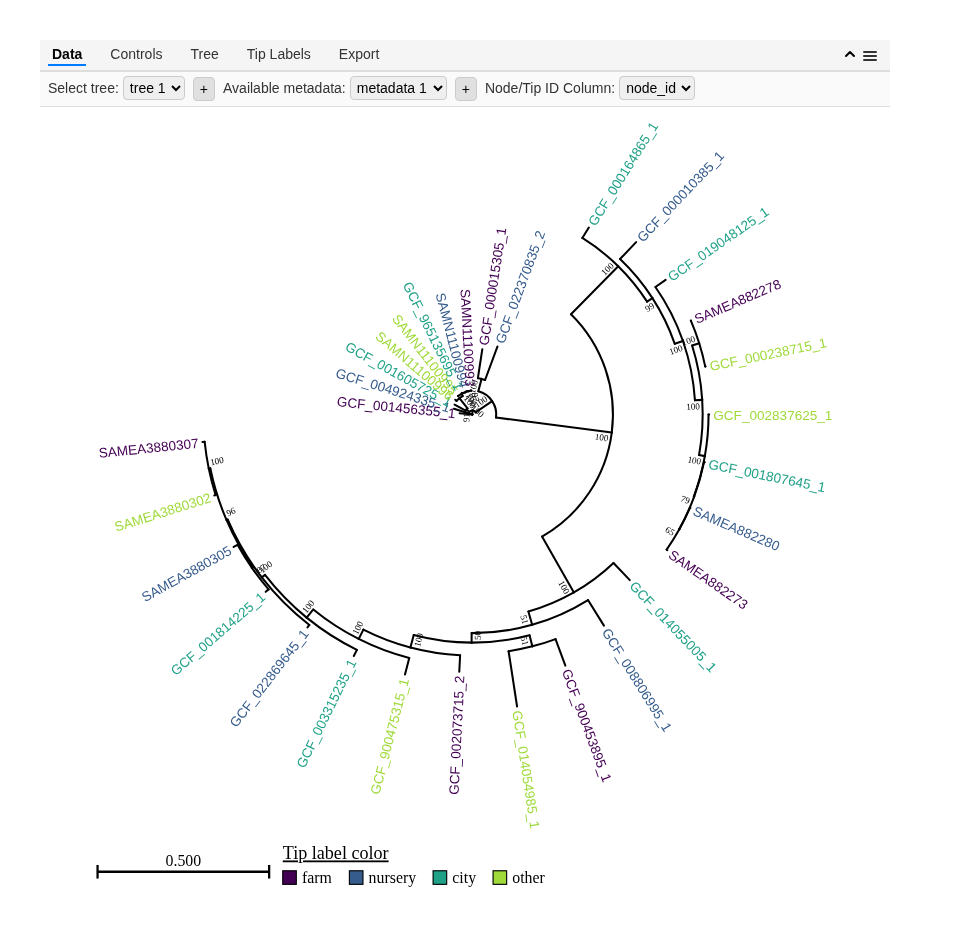

# The `heattree` R package

This package makes it easy to visualize, manipulate, and export
phylogenetic trees in R using an interactive viewer/editor. You can
insert this tree viewer into Rmd/Quarto documents make your trees
accessible online. If you want to use this for web development outside
of R, consider the [javascript `heat-tree`
package](https://www.npmjs.com/package/@grunwaldlab/heat-tree) which
this package builds upon.

## Installation

For now, `heattree` is only available on Github and can be installed
with `devtools`:

    devtools::install_github('grunwaldlab/heattree')

## Quick start

The package includes example data sets that are automatically loaded
with the package (`example_tree_1`), so you can try it out with minimal
effort. After installing the packages, simply run the lines below to get
an idea of how it works:

    library(heattree)
    heat_tree(example_tree_1, metadata = example_metadata_1, aesthetics = c(tipLabelColor = 'source'), layout = 'circular')

[**See the “Getting Started” page for interactive
examples**](articles/Getting-started.html)

## Contributing and feedback

Contributions and feedback are welcome! Please visit the [GitHub
repository](https://github.com/grunwaldlab/heattree) to report issues or
submit pull requests.
